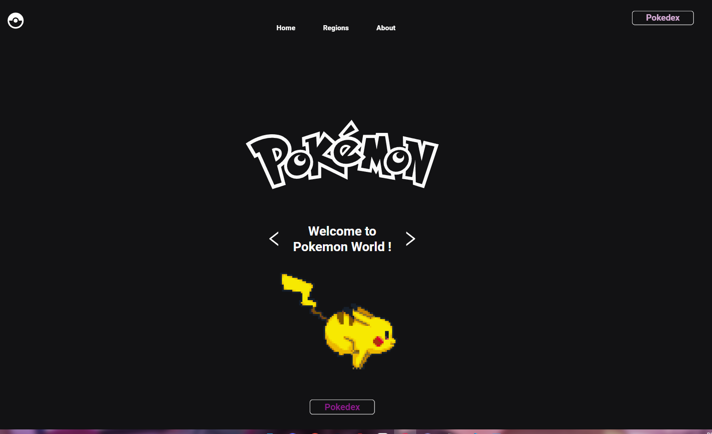
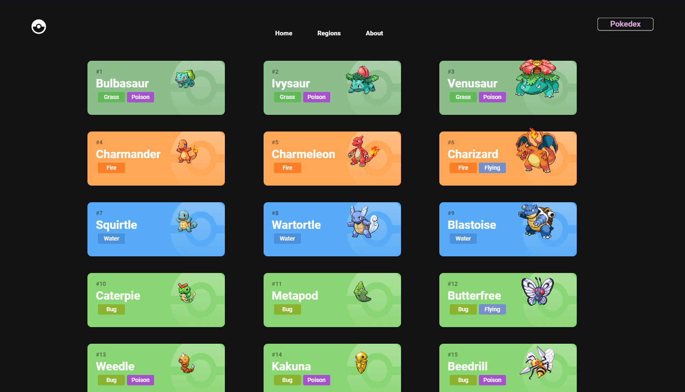
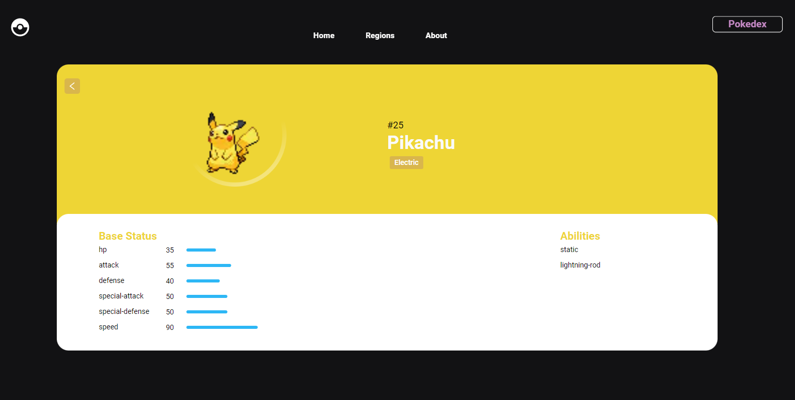

# Pokemon - Pokedex

Aplicação desenvolvida com Next.js e TypeScript, utilizando Styled Components para estilização. O projeto consome a PokeAPI pública (pokeapi.co) para exibir informações detalhadas sobre pokémons,
                 incluindo seus tipos, habilidades, descrições e outras estatísticas. A interface é responsiva e exibe cards com coloração dinâmica conforme o tipo de cada pokémon,
                  proporcionando uma experiência visual imersiva. A aplicação conta com recursos de paginação para navegação eficiente entre grandes volumes de dados. A estrutura do código é modular,
                  garantindo fácil manutenção e escalabilidade, com foco na organização e boas práticas de desenvolvimento.

[Go to WebSite - Click Me !](https://gustavopokemonpokedex.vercel.app)
